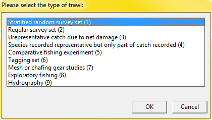

# **Stratisfy**
### (an R-based version of STRANAL)
#### Oct 30, 2015
---

[Introduction and Approach](#Intro)  
[Current Limitations](#Limits)  
[Running the Script](#Running)  
[Results](#Results)  
[Changes from APL Version Results](#Changes)  
[Development of stratisfy](#R-vers)  
[Historic Documentation](README_archived.md) 

---

## <a name="Intro"></a>  Introduction and Approach
STRANAL (or "Stratified Analysis") has been used by Fisheries Biologists at DFO and NMFS to assist with assessments since before 2006.  While the original application still works well, it was written in <a href="https://en.wikipedia.org/wiki/APL_(programming_language)">APL</a>, and the number of people who are able to modify and enhance STRANAL is dwindling &lt;cough&gt; Jim Gale &lt;cough&gt;.  As a result, we have translated the application into R, a language known to many within the Population Ecology Division.  For clarity, the R version of this application has been coined **"Stratisfy"** to differentiate it from the original, as well as to salute the original creator of STRANAL, Stratis Gavaris.

The approach taken by this project has been to ensure **maximum flexibility**.  This means that the script should run regardless of:  
 * working directory  
 * OS  
 * mechanism for running R (i.e. R vs R Studio)  

 If options need to be set, or packages installed, the script should either do it, or prompt the user to do so.  The easier it is to run, the more collaboration we can expect.  The hope is that users will be better able to collaborate and enhance Stratisfy now that the code is readily accessible.  Additionally, since it is now a script rather than an application, its operation is transparent, and PED staff can maintain it without IMTS support.

## <a name="Limitations"></a>  Current Limitations
As of right now, the Stratisfy does not yet include:

*  ~~Sex-specific Analysis~~
*  ~~Querying of NMFS data~~ (Not yet perfect correlation with STRANAL results, but not convinced that the problems are with stratisfy)
* Vessel Net Conversion
*  ALK Modifications (including User-specified age/length table)

## <a name="Running"></a>  Running the Script
stratisfy.r is currently a single function ("stratisfy").  Simply load the function into R, and run it, most likely saving the results to a variable.  It can only be run via the built-in Graphical User Interface (GUI).  If a correct Oracle username and password are not provided, you will be prompted to provide them.  I decided against allowing this script to be run via the command line, since:

  1.  Using pick-lists ensures that inputs are valid and in the format that the script expects;
  2.  Only valid options are shown to the user. 

The script can be run like the following:

```R
# run using all defaults - this will prompt you for your oracle username and password
results<-stratisfy()

# run with your oracle username and password
results<-stratisfy(user='mcmahonm', password='mypassword')

# by saving your username and password into your .rprofile file, you don't 
# need to enter your username or password at all
results<-stratisfy(user=oracle.personal.username,password=oracle.personal.password)
```
When the script is run, the user will be prompted for the following:
*  Agency
*  Sexed or Unsexed Analysis
*  Survey Type (Only for Agency == 'DFO')
*  Wingspread (ft)
*  Species (choices depend on selected values of 'agency' and 'sexed/unsexed')
*  Year
*  Mission (choices depend on selected value of 'year')
*  Strata (choices depend on selected value of 'year', 'mission' and 'type')
*  Areas (choices depend on selected value of 'year', 'type' and 'strata')
*  Tow Distance (not really a choice - only 1.75nm is available - other distances could be added)

<!--





-->

## <a name="Results"></a>  Results
When the script is run, the result is a list, composed almost entirely of data frames.  For the most part, these data.frames correspon with the worksheets that were output by the APL version of the application.  The following table outlines:
*  The Result  
*  The equivalent worksheet generated by APL version  
*  How to reference it  
*  The available columns (* rows, if applicable).


|R Result							|Legacy (APL) STRANAL equivalent worksheet(s)																							| 	Reference		|	Columns(<a href="#TableNotes">*</a>)																																				|
|------------------------------		|------------------------------																											| 	---------------	|	------------------------------																														|
|input&#95;parameters				|&quot;QUERY&quot;																														| 	results[[1]] 	|	Stranal version; Analysis Date; Experiment Type; Strata; Missions; Year; Species; Wingspread; Distance; Data Source; ALK Modifications; Area;		|
|strata.areas						|&quot;Strata Area&quot; ; &quot;Prop Area&quot;; &quot;Prop Area Std Err&quot;; &quot;Total Area&quot;; &quot;Total Area Std Area&quot;| 	results[[2]] 	|	TUNITS; SQNM; AreaProp; AreaPropStErr; AreaTot; AreaTotStErr																					    |
|set&#95;info						|&lt;New&gt;																															| 	results[[3]] 	|	MISSION; SEASON; STRAT; SETNO; SDATE; AREA; SLAT; SLONG; DMIN; DMAX; DEPTH; DUR; DIST																|
|length&#95;by&#95;set				|&quot;Length by Set&quot;																												| 	results[[4]] 	|	STRAT; MISSION; SETNO; &lt;length bins&gt;; TOTAL																									|
|length&#95;mean					|&quot;Length Mean&quot;																												| 	results[[5]] 	|	STRAT; &lt;length bins&gt;; RowTotals																												|
|length&#95;mean&#95;se				|&quot;Length Mean Standard Error&quot;																									| 	results[[6]] 	|	STRAT; &lt;length bins&gt;																															|
|length&#95;total					|&quot;Length Total&quot;																												| 	results[[7]] 	|	STRAT; &lt;length bins&gt;																															|
|length&#95;total&#95;se			|&quot;Length Total Standard Error&quot;																								| 	results[[8]] 	|	STRAT; &lt;length bins&gt;																															|
|nw&#95;by&#95;set					|&quot;Weight By Set&quot;; &lt;New&gt;																									| 	results[[9]] 	|	STRAT; MISSION; SETNO; TOTNO; TOTWGT																												|
|weights							|&quot;Weight Mean&quot;;  &quot;Weight Mean Std Err&quot;;  &quot;Weight Total&quot;; &quot;Weight Total Std Err&quot;					| 	results[[10]]	|	STRAT; COUNT; TOT&#95;WGT; MEAN&#95;WGT; BIOMASS; ST&#95;ERR&#95;WGT; ST&#95;ERR&#95;BIOMASS														|
|numbers							|&lt;New&gt;																															| 	results[[11]]	|	STRAT; COUNT; TOT&#95;NO; MEAN&#95;NO; ABUND; ST&#95;ERR&#95;NO; ST&#95;ERR&#95;ABUND																|
|age&#95;table						|&quot;Age Table&quot;																													| 	results[[12]]	|	&lt;ages&gt;; Length&#95;Totals*&lt;length bins&gt;																									|
|age&#95;length&#95;key&#95;totals  |&quot;Age Length Key&quot;																												| 	results[[13]]	|	&lt;ages&gt;*&lt;length bins&gt;																													|
|age&#95;length&#95;weight			|&quot;Age Length Weight&quot;																											| 	results[[14]]	|	allFlen; FWT.&lt;ages&gt;*&lt;length bins&gt;																										|
|age&#95;by&#95;set					|&quot;Age By Set&quot;																													| 	results[[15]]	|	STRAT; MISSION; SETNO; &lt;ages&gt;																													|
|ages								|&quot;Age Mean&quot;; &quot;Age Mean Std Error&quot;; &quot;Age Total&quot;; &quot;Age Total Standard Error&quot;                      | 	results[[16]]	|	STRAT; COUNT; age&#95;&lt;ages&gt;&#95;mean; age&#95;&lt;ages&gt;&#95;se; age&#95;&lt;ages&gt;&#95;tot; age&#95;&lt;ages&gt;&#95;tot&#95;se		 	|

<a name="TableNotes"></a>*values like &lt;length bins&gt; or &lt;ages&gt; have actual numeric values

## <a name="Changes"></a>  Changes from APL Version Results:
Some of the available results combine results that was previously available on mutiple sheets:
*  "strata.areas" is a combination of:  
  * &quot;Strata Area&quot;  
  * &quot;Prop Area&quot;  
  * &quot;Prop Area Std Err&quot;  
  * &quot;Total Area&quot;  
  * &quot;Total Area Std Area&quot;   
*  "weights" is a combination of:
  *  &quot;Weight Mean&quot;
  *  &quot;Weight Mean Std Err&quot;
  *  &quot;Weight Total&quot;
  *  &quot;Weight Total Std Err&quot;
* "ages" is a combination of:
  *  &quot;Age Mean&quot;
  *  &quot;Age Mean Std Error&quot;
  *  &quot;Age Total&quot;
  *  &quot;Age Total Standard Error&quot;   
 
Some of the available results were not available in the APL version:  
*  "set_info" (i.e. results[[3]])
*  "numbers" (i.e. results[[11]])
*  "nw_by_set" (i.e. results[[9]])	is a combination of "weight by set", as well as a new "numbers by set" result

**"Numbers and Weights"** was a popular analytic produced by the VDC (PED - Maritimes>Research Surveys> 01 CDN Ecosystem> <a href="http://marvdc.bio.dfo.ca:7778/pls/vdc/mwprojectweb.dispatch?link_id=486">Numbers and Weights</a>).  The values generated by that are now available via stratisy as "numbers" and "weights" (i.e. results[[11]] and results[[10]], respectively).

## <a name="R-vers"></a>  Development of stratisfy
*Mike McMahon Oct 2015*  
> I have made the initial effort to support the extraction of USNEFSC data.  There is not yet 100% agreement with the APL STRANAL application.

*Mike McMahon Sept 2015*  
> Mark Fowler did an initial conversion of the APL code to R.  It required write-access to an Oracle schema for generating temporary tables, and required jumping between SQL and R.  I retained much of the SQL, but drastically changed the approach.  It is now a single R file that walks users through a series of pick-lists that generally limits the extractions to only the desired missions, strata and species.  

*Mark Fowler Aug 2014*  
(Marks' original script is [here](archived/STRANAL.txt), and the original script for running USNEFSC data is [here](archived/STRANALUS.txt).
> Interactive scripting, jumping around between SQL and R 
> Current example is 4X Haddock in 1974. This was truthed against the 
> original APL version of STRANAL by Stratis Gavaris.  
>  
> Intention is to add STRANAL to SurveyScope as a web application. This
> scripting file serves to document the methods, and may suffice if the 
> APL version is lost to us before incorporation into SurveyScope. 
> Apparently IT will not maintain the original.
> Arithmetic precision differs between APL and R. For example we see 
> differences in stratified means beginning about the 3rd decimal
>  place. After all the math and rounding and bumping by trawlable 
> units, we see annual totals of 89563863 from The APL STRANAL and
> 89563906 from the R STRANAL, a difference of 0.0000005%.
> Using Oracle SQL*Plus (from the DFO SMS) to create custom database 
> objects. Not the only way to do this. Requires an account with access 
> to GROUNDFISH on BANK. 
> 
> Stock identification (species, strata) is hard-coded so must be 
> edited as required for several of the SQL steps.
> 
> Sex and bin width stipulations are the 'official' defaults pulled 
> from groundfish.gsspec. If you want to change these go to the SQL 
> step that creates stock_all_raw_age and follow instructions in 
> comments there. Encountered a conceivable error in the APL STRANAL, 
> but could also be a known and disregarded issue. This is discussed in 
> comments associated with replicating the Length Weight sheet.

> Some scripting is redundant with SurveyScope, but included here so 
> STRANAL can be achieved as a stand-alone job.  
