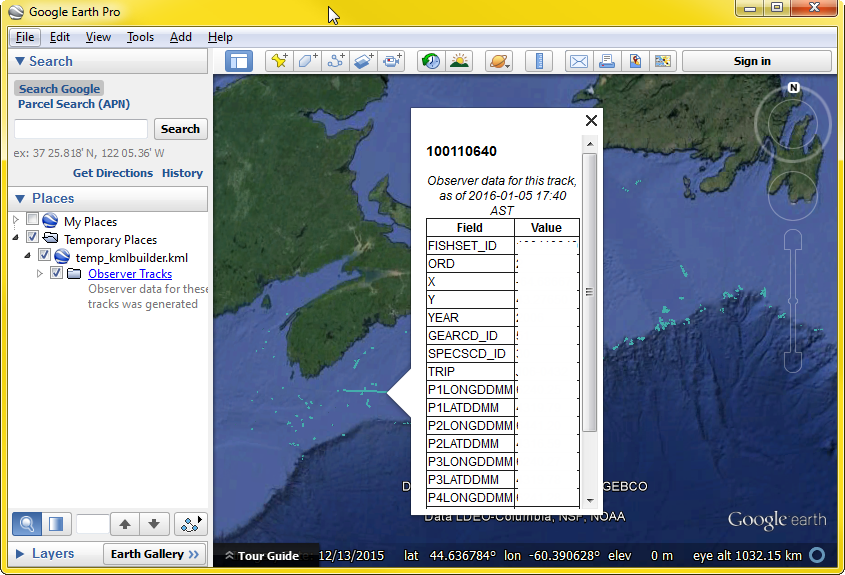

# **[observer.track.kml.r](../src/_RFunctions/observer.track.kml.r)**
(see also [observer.track.selector.r](../src/_RFunctions/observer.track.selector.r))
#### MMM - Jan 2016 
This function generates a kml (i.e. Google Earth) file of a dataframe, with all of the attributes for each track available in the pup-up ballons.

This is a fast and effective way to QC observer data.

```R
test<-observer.track.kml(tow.tracks,"tow_tracks")

#or even fancier, do the following to select data, 
#and then automatically plot the tows
observer.track.kml(observer.track.selector()[[2]],"tow_tracks")
```
##Requires
A dataframe containing fields named "fishset_id", and fields named X and Y (corresponding with lon, and lat, respectively).

##Output

