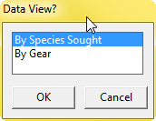
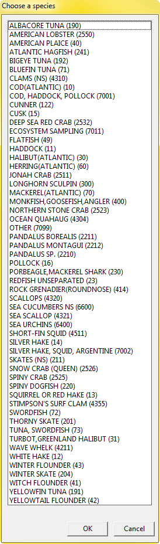
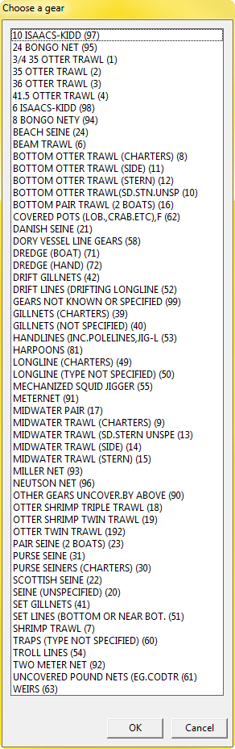
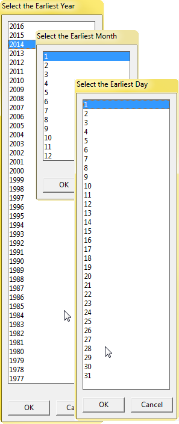
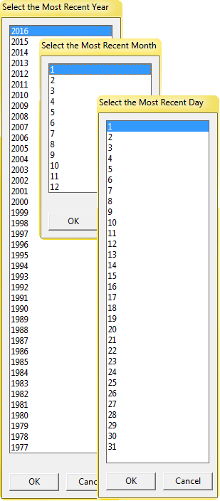

# **[observer.track.selector.r](../src/_RFunctions/observer.track.selector.r)**
(see also [observer.track.kml.r](../src/_RFunctions/observer.track.kml.r))
#### MMM - Jan 2016 
This function prompts the user for:
*    gear | sought species
*    start date
*    end date

and uses the selections to query the observer schema for matching data.  It then generates a series of potentially useful dataframes containing vessel tracks, based on the p1-p4 position information.


|output      |positions|Interpretation|
|-------------|------|-------|---------------|
|results[[1]]|p1-p2|set.deploy|
|results[[2]]|p2-p3|set.tow|
|results[[3]]|p3-p4|set.retrieve|
|results[[4]]|p1-p4|set.all|

Depending on the fishery and/or gear type, any one of these output might be useful.

The original purpose of this was as a means for the Halibut group to QC the observer data, but it was easily expanded to handle other species and also gears.

To run it, simply do
```R
test<-observer.track.selector()
```

##Requires
An account with permission to the Observer schema

#Output
<br>

<br>


