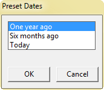
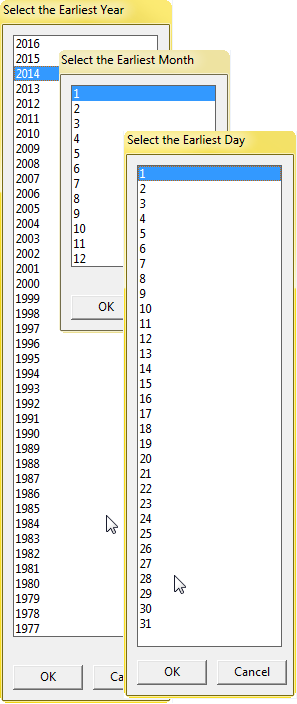
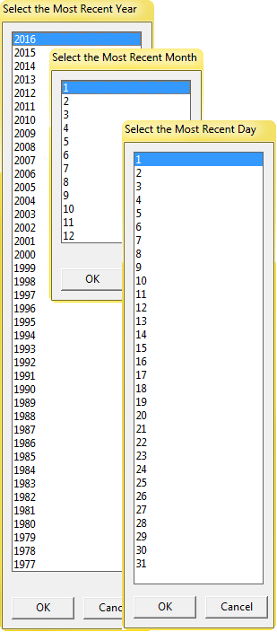

# **[date.picker.r](../../src/_RFunctions/utility/datetime/date.picker.r)**
#### MMM - Jan 2016 
This function presents successive picklists for year, month and day, and returns a date in the format "YYYY-MM-DD".  Only valid days for each month and year combo are presented.  Most complexity is due to the potential for users to click cancel rather than choose valid options.  Cancelling at any point fails gracefully, and results will depend on the selected parameter.   

The original purpose of this function is to provide a means to select valid dates for use in modifying SQL queries on demand.

Dates are returned in the format 'YYYY-MM-DD'

It can accept the following parameters:
"presets"   -  for quickly getting the date from a year ago, 6 months ago, 
              or todays date (add as desired)

"default" or "start"  - any time the user cancels the dialog boxes, it 
                           defaults to the earliest date corresponding to the 
                           user's selections (e.g. if only the year was 
                           chosen (e.g. 1988), it would return 1988/01/01) 

"end"  - any time the user cancels the dialog boxes, it defaults to the 
            latest available date corresponding to the user's selections 
            (e.g. if only the year and month was chosen (e.g. February and 
            1988), it would return 1988/02/29 )

