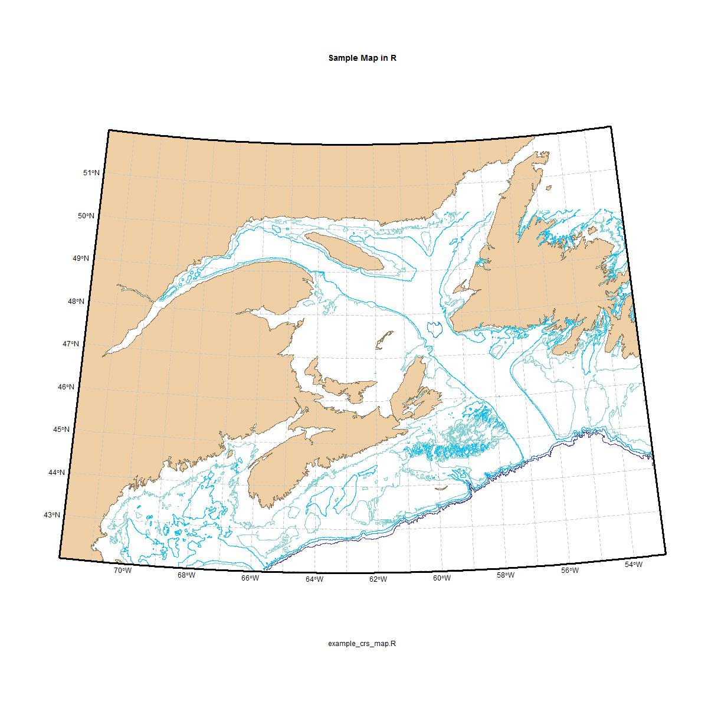

# **[example_crs_map.R](../../src/_Rfunctions/spatial/example_crs_map.R)**
#### Feb 9, 2016
MMM - 2016 
This makes a basemap using number of packages.

This script makes a nice looking, publication quality map.  It handles projections nicely, and with the exception of bathymetry data, requires no local data.

It is not written as a function, and I'm not sure if that would be useful.