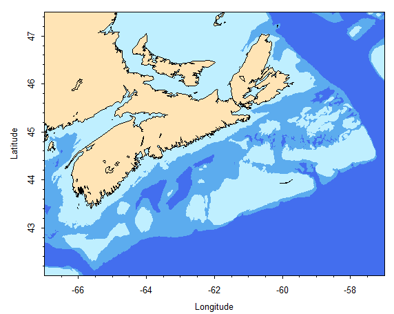

# **[makeMapBasic.r](../../src/_RFunctions/spatial/makeMapBasic.r)**
#### Jan 4, 2016
MMM - 2016 
This function generates a map using PBSmapping plotting functions.  It is a simplified version of Ben Z's original called [makeMap.r](makeMap.md) function.  
It was simplified and generalized by MMM such that: 
*  area extents added as a separate function (getExtent.R)
*  numerous more extents added for use by that function


Example created by simply running:
```R
makeMapBasic()
```