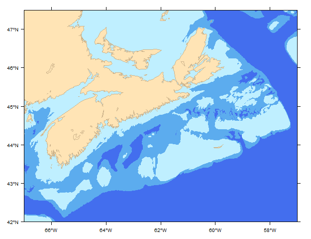

# **[makeSpMap.R](../../src/_Rfunctions/spatial/makeSpMap.R)**
#### Jan 4, 2016
MMM - 2016 
This makes a simple basemap from shapefiles using sp and rgdal.



I like it because: 
*  the inital extent can be set prior to drawing the map;
*  each layer is added only once (no need to redraw the coastline)

Additional layers can be added like this:

First, create a basemap to which you will add layers:
```R
base<-makeSpMap()
```

If workling with shapefiles, load them via readOGR, and transform it to WGS84 (if necessary)
```R
newshape="myshapefile_83UTM20N.shp"
newshape<-readOGR(<PATH_TO_SHAPEFILE>,gsub(".shp","",newshape))
    # if required, transform to WGS84 to match the base data
    crs.geo <- CRS("+init=epsg:4326")
    newshape=spTransform(newshape, crs.geo)
```
Add layers to the basemap
```R
#for points
myMap=base+layer(sp.points(newshape, col="black", under=F)) 
#for lines
myMap=base+layer(sp.lines(newshape, col="black", under=F)) 
#for polygons
myMap=base+layer(sp.polygons(newshape, col="black", under=F)) 
```
Repeat for each additional layer, and finally, draw the final product
```R
myMap
```